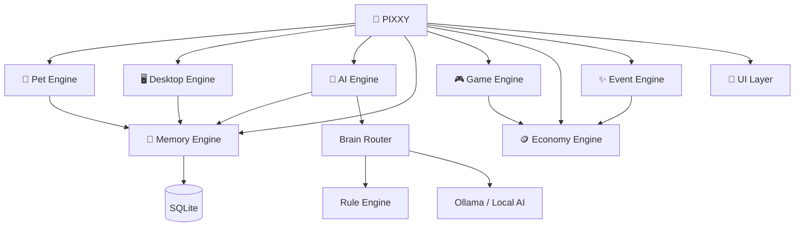

# 🐾 Pixxy

> **A tiny digital life that lives on your desktop.**
>
> A desktop-first virtual pet and local AI companion that remembers you, reacts to your activity, grows with you, and remains useful even when AI is turned off.

<p align="center">
  <strong>🐾 The pet is the product. AI makes the pet smarter and more alive.</strong>
</p>

<p align="center">
  <a href="#-what-is-pixxy">What is Pixxy?</a> •
  <a href="#-mvp">MVP</a> •
  <a href="#-architecture">Architecture</a> •
  <a href="#-roadmap">Roadmap</a> •
  <a href="#-development">Development</a>
</p>

---

## ✨ What is Pixxy?

Pixxy is a **Windows desktop virtual pet + digital companion**. It appears directly on your desktop as a small animated creature with needs, moods, personality, memory, a room, games, rewards, and evolving behavior.

The AI layer is intentionally optional. Pixxy's core pet mechanics, state, games, economy, events, animations, and privacy controls work without an LLM.

<details>
<summary>💡 <strong>Why Pixxy is different</strong></summary>

<br>

| Traditional AI chatbot | Pixxy |
|---|---|
| AI is the product | 🐾 The virtual pet is the product |
| Usually cloud-first | 🔒 Local-first by design |
| Stateless conversations | 🧠 Persistent local memory |
| Avatar around a chatbot | 🌎 A persistent digital world |
| AI controls behavior | ⚙️ Deterministic pet engine controls core state |
| Little reason to return | 🎮 Games, rewards, room, progression |
| Passive interaction | 🖥️ Optional desktop awareness |

</details>

---

## 🎯 Product Principles

> [!IMPORTANT]
> **Pixxy should never become simply “a cute UI around an LLM.”**

- 🐾 Pixxy must remain fun with AI completely disabled.
- 🧠 AI is an intelligence layer, not the entire product.
- 🔒 Local-first data handling is the default.
- 👤 Users control what Pixxy remembers and observes.
- ⚙️ Core pet state is deterministic and independent of the LLM.
- 💤 Pixxy should feel alive without becoming annoying or intrusive.
- 🚀 Ship a small, polished, installable MVP before expanding the scope.

---

## 🧩 Core Systems



<details>
<summary>🔍 <strong>System responsibilities</strong></summary>

<br>

- **Pet Engine** — needs, moods, state transitions, personality, evolution.
- **Desktop Engine** — high-level active-app, idle-time, session and desktop-state awareness.
- **Memory Engine** — local memories, preferences, projects and interactions.
- **AI Engine** — optional local LLM conversation and contextual responses.
- **Game Engine** — mini-games and gameplay mechanics.
- **Economy Engine** — XP, coins, rewards and unlockables.
- **Event Engine** — discoveries, gifts, surprises and scripted events.
- **UI Layer** — transparent pet window, room, menus, dashboard and settings.
- **Asset System** — characters, animations, furniture, rooms, sounds and icons.

</details>

---

## 🚀 MVP

The first release is deliberately small.

### Must Have

- [ ] 🖥️ Transparent desktop pet window
- [ ] 🐹 Pixxy character
- [ ] ✨ Idle animation
- [ ] 🖱️ Click interaction
- [ ] 🏠 Basic room
- [ ] 🍎 Hunger
- [ ] ⚡ Energy
- [ ] ❤️ Happiness
- [ ] 😊 Mood engine
- [ ] 💾 Basic local memory
- [ ] 🗃️ SQLite persistence
- [ ] 🖥️ Application awareness
- [ ] 💬 Rule-based reactions
- [ ] 🪙 Coins
- [ ] 🎮 One polished mini-game
- [ ] ⚙️ Settings
- [ ] 🪟 Windows startup option
- [ ] 🧠 Optional local AI

### Explicitly out of MVP

<details>
<summary>🚧 <strong>Future scope</strong></summary>

<br>

Evolution • Multiple species • Large furniture catalogue • Mobile app • Multiplayer • Cloud sync • Large agentic system • Voice assistant • Many mini-games • Social network

</details>

---

## 🧠 Local AI Philosophy

Pixxy is designed to work **without an AI model**.

```text
                 PIXXY
                   │
          ┌────────┴────────┐
          │                 │
     VIRTUAL PET         LOCAL AI
          │                 │
     Needs / Mood      Conversation
     Room / Games      Memory / Context
     Economy           Personality
     Events
          │
          └───────┬─────────┘
                  ↓
             DESKTOP WORLD
```

The initial AI integration is planned around an **Ollama adapter**, behind a provider interface so the rest of the application is not tightly coupled to one runtime.

> [!NOTE]
> Runtime/model packaging and redistribution terms must be verified before shipping an installer that automatically installs AI components.

---

## 🛠️ Technology Stack

| Layer | Technology | Purpose |
|---|---|---|
| Desktop shell | **Electron** | Transparent window, tray, Windows integration |
| Frontend | **React + TypeScript** | UI, room, menus, settings, dashboard |
| Application logic | **Node.js + TypeScript** | Pet engine, services, orchestration |
| Database | **SQLite** | Local persistent storage |
| AI runtime | **Ollama adapter** | Local LLM integration |
| Assets | **PNG / SVG / Sprite Sheets** | Character, room, furniture and UI |
| Packaging | **Electron Builder** | Windows installer/executable |

---

## 🗂️ Planned Project Structure

```text
pixxy/
├── app/
│   ├── main/
│   │   ├── application/
│   │   ├── window_manager/
│   │   └── startup/
│   ├── pet/
│   │   ├── state/
│   │   ├── mood/
│   │   ├── personality/
│   │   ├── needs/
│   │   └── evolution/
│   ├── desktop/
│   │   ├── activity_monitor/
│   │   ├── app_detector/
│   │   └── idle_detector/
│   ├── memory/
│   │   ├── database/
│   │   ├── memory_manager/
│   │   └── preferences/
│   ├── game/
│   │   ├── economy/
│   │   ├── achievements/
│   │   └── minigames/
│   ├── ai/
│   │   ├── provider/
│   │   ├── ollama/
│   │   ├── prompt_manager/
│   │   └── context_manager/
│   └── events/
│       ├── event_manager/
│       └── event_definitions/
├── assets/
│   ├── characters/
│   ├── animations/
│   ├── rooms/
│   ├── furniture/
│   ├── sounds/
│   └── icons/
├── database/
├── installer/
├── tests/
└── docs/
```

---

## 🗺️ Roadmap

<details open>
<summary>Phase 0 — 📋 Product Specification</summary>

- [ ] Detailed PRD
- [ ] Pixxy personality definition
- [ ] Target audience
- [ ] Privacy model
- [ ] MVP boundaries
- [ ] UI/UX flow
- [ ] Pet mechanics
- [ ] Technical architecture

</details>

<details>
<summary>Phase 1 — 🎨 Character & Visual Assets</summary>

- [ ] Visual brief
- [ ] Character concepts
- [ ] Final design
- [ ] Character sheet
- [ ] Expression sheet
- [ ] Animation references
- [ ] Transparent base assets
- [ ] Sprite sheets
- [ ] Initial room
- [ ] Furniture and UI assets

</details>

<details>
<summary>Phase 2 — 🖥️ Desktop Shell</summary>

- [ ] Electron project
- [ ] Transparent frameless window
- [ ] Always-on-top option
- [ ] Dragging
- [ ] Scaling
- [ ] System tray
- [ ] Hide/show
- [ ] Startup option

</details>

<details>
<summary>Phase 3 — 🐾 Pet Engine</summary>

- [ ] Pet state model
- [ ] Hunger
- [ ] Energy
- [ ] Happiness
- [ ] Social / curiosity / boredom
- [ ] Mood rules
- [ ] State transitions
- [ ] Mood-driven animation

</details>

<details>
<summary>Phase 4 — 💾 Database & Persistence</summary>

- [ ] SQLite schema
- [ ] Database initialization
- [ ] Repositories/services
- [ ] Pet state persistence
- [ ] User settings persistence
- [ ] Coins and XP persistence
- [ ] Room persistence
- [ ] Events and achievements
- [ ] Restart persistence tests

</details>

<details>
<summary>Phase 5 — 🖥️ Desktop Awareness</summary>

- [ ] Active application detection
- [ ] Idle detection
- [ ] Session tracking
- [ ] Lock/unlock awareness
- [ ] Privacy controls
- [ ] Rule-based reactions
- [ ] Multi-application testing

</details>

<details>
<summary>Phase 6 — 🧠 Personality & Memory</summary>

- [ ] Personality traits
- [ ] Interaction history
- [ ] Explicit memory creation
- [ ] Memory retrieval
- [ ] Memory management UI
- [ ] Memory deletion
- [ ] Behavior connection

</details>

<details>
<summary>Phase 7 — 🏠 Room & Economy</summary>

- [ ] Room scene
- [ ] Furniture placement
- [ ] Inventory
- [ ] XP
- [ ] Coins
- [ ] Achievements
- [ ] Unlockable items
- [ ] Productivity rewards

</details>

<details>
<summary>Phase 8 — 🎮 Mini-Game</summary>

**First game: Catch the Falling Food**

- [ ] Controls
- [ ] Scoring
- [ ] Rewards
- [ ] High score
- [ ] Pixxy reactions
- [ ] Performance testing

</details>

<details>
<summary>Phase 9–10 — 🤖 Local AI & Personality</summary>

- [ ] AI provider interface
- [ ] Ollama integration
- [ ] Runtime detection
- [ ] Model configuration
- [ ] Context builder
- [ ] Pixxy system/personality prompt
- [ ] Conversation UI
- [ ] AI fallback behavior
- [ ] Mood/personality injection
- [ ] Memory context
- [ ] Desktop context where permitted
- [ ] Response limits

</details>

<details>
<summary>Phase 11–13 — 📦 Installer, QA & Beta</summary>

- [ ] Production build
- [ ] Windows installer
- [ ] Prerequisite checks
- [ ] Hardware detection
- [ ] Optional AI setup
- [ ] Clean install testing
- [ ] Upgrade testing
- [ ] Offline testing
- [ ] Multi-monitor testing
- [ ] DPI/scaling testing
- [ ] Privacy audit
- [ ] Beta release
- [ ] Feedback loop

</details>

---

## 🔒 Privacy by Design

Pixxy is intended to be **local-first**.

Users should be able to control whether Pixxy can:

- Remember things explicitly told to it
- Remember application activity
- Remember productivity patterns
- Remember conversations
- Automatically create memories
- View stored memories
- Delete individual memories
- Delete all Pixxy data

### 🚫 MVP does not need

Pixxy should avoid collecting **document contents, keystrokes, passwords, or sensitive content**. Desktop awareness should focus on high-level signals and remain opt-in/configurable.

---

## 🎮 Core Pet Mechanics

| Need | Range | Example state |
|---|---:|---|
| Hunger | 0–100 | Hungry below threshold |
| Energy | 0–100 | Sleepy below threshold |
| Happiness | 0–100 | Excited when high |
| Social | 0–100 | Lonely when low |
| Curiosity | 0–100 | Drives exploration |
| Boredom | 0–100 | Drives interaction |

Mood is **state-driven**, not LLM-driven.

```text
Hunger < 20       → Hungry
Energy < 15       → Sleepy
Happiness > 80
+ Energy > 50     → Excited
Social < 20       → Lonely
Healthy state     → Happy
```

---

## 🖥️ Desktop Awareness

Pixxy may react to high-level signals such as:

- Active application/window
- Idle time
- Session duration
- Computer lock/unlock
- Startup/shutdown
- Application switching patterns

Examples:

> **VS Code** → “Coding again?”  
> **Power BI** → “Dashboard time!”  
> **Excel** → “Rows and columns... exciting.”  
> **Spotify** → “Okay, DJ.”  
> **Long focus session** → “You've been working for a while.”

These reactions can initially be completely rule-based.

---

## 🪙 Progression

### XP

- Focus session
- Complete a task
- Daily streak
- Return to Pixxy
- Take a healthy break
- Unlock achievements

### Coins

| Action | Reward |
|---|---:|
| 30-minute focus session | +10 |
| Complete task | +20 |
| Daily login | +5 |
| Mini-game | +2 |
| Achievement | +50 |

Coins can unlock hats, accessories, plants, furniture, room themes and special items.

---

## 🛡️ Definition of Done — MVP

- [ ] Installs successfully on a clean Windows machine
- [ ] Appears as a transparent desktop companion
- [ ] Has polished idle and interaction animations
- [ ] Pet state changes over time
- [ ] Mood changes according to state
- [ ] User interactions affect Pixxy
- [ ] State persists after restart
- [ ] Basic desktop context detection works when enabled
- [ ] Selected applications trigger local reactions
- [ ] User earns and spends coins
- [ ] One mini-game is playable
- [ ] Basic memory works locally
- [ ] Privacy controls are visible and functional
- [ ] Pixxy works without an AI model
- [ ] Optional local AI works for conversation
- [ ] Production installer installs/uninstalls cleanly

---

## 🧪 Development

> The repository is currently being initialized from the Pixxy product blueprint. Implementation should proceed in phases rather than attempting the entire product at once.

### Prerequisites

- Windows 10/11
- Node.js LTS
- npm
- Git
- Optional: Ollama-compatible local AI environment

### Planned setup

```bash
# Clone
git clone https://github.com/SohaibMKhan/pixxy.git
cd pixxy

# Install dependencies
npm install

# Start development
npm run dev
```

> [!WARNING]
> The commands above are the intended project workflow; they may remain unavailable until the initial Electron/React/TypeScript skeleton is committed.

---

## 📚 Documentation

| Document | Purpose |
|---|---|
| `docs/PRD.md` | Detailed product requirements |
| `docs/ARCHITECTURE.md` | Technical architecture |
| `docs/PRIVACY.md` | Privacy and data-handling model |
| `docs/ROADMAP.md` | Development roadmap |
| `docs/ASSETS.md` | Character and asset pipeline |
| `docs/CONTRIBUTING.md` | Contribution workflow |

---

## 🌱 Future Vision

### V1
Evolution, more rooms, accessories, games, improved memory, better AI, sound and themes.

### V2
Multiple species, personality variations, dynamic world, stories, events and collectibles.

### V3
Optional mobile companion, encrypted sync, voice interaction, multiple Pixxies and optional community features.

---

## ⭐ The North Star

> **Pixxy should feel like a small digital life that exists independently of the AI model.**

The strongest architecture is therefore:

**Virtual Pet + Local AI + Desktop World**

Not a chatbot with a pet skin.

---

## 📜 License

License to be determined as the project matures.

---

<p align="center">
  <strong>🐾 PIXXY</strong><br>
  <em>Desktop-first local AI companion</em><br><br>
  Built around a simple idea:<br>
  <strong>The pet is the product. The AI makes the pet smarter and more alive.</strong>
</p>
