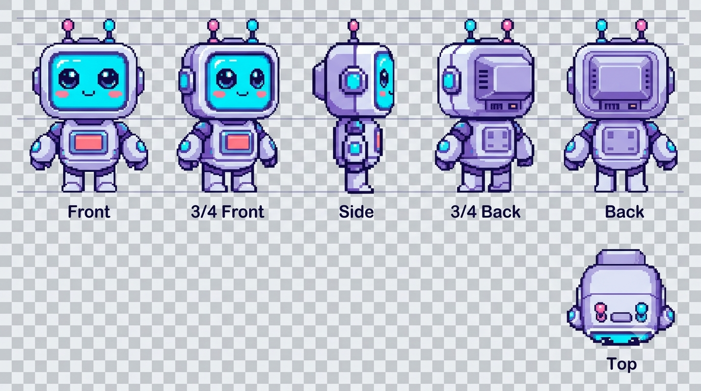
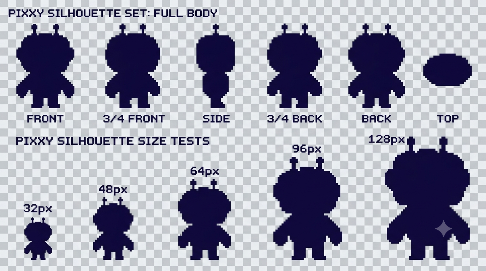
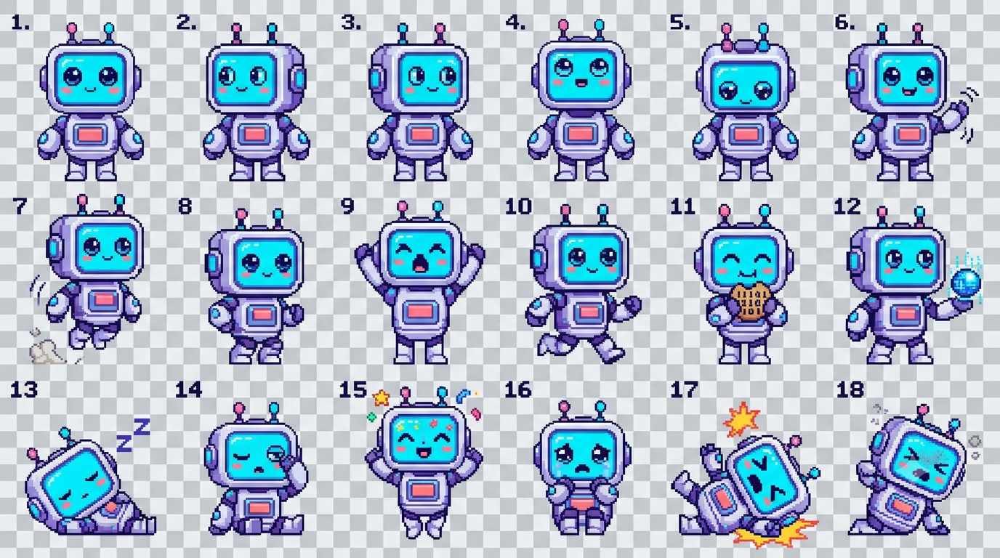
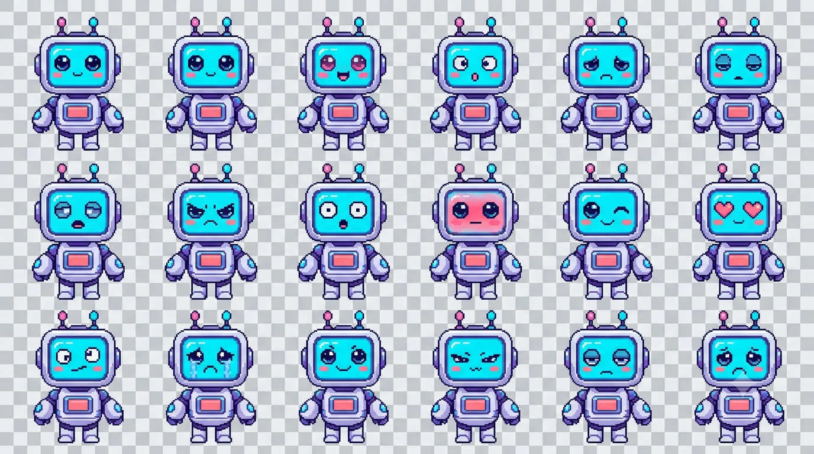

<div align="center">

# 🐾 Pixxy

### A desktop-first local AI virtual pet & digital companion for Windows

*The pet is the product. AI makes the pet smarter and more alive.*



**Local-first • Desktop-native • Persistent • Playful • AI-enhanced**

</div>

---

## What is Pixxy?

Pixxy is designed to be a **small digital creature that actually lives on your desktop** rather than a chatbot hidden behind an application window.

The long-term product combines virtual-pet mechanics, personality, memory, desktop awareness, games, rewards, room customization and an optional local AI layer. The product blueprint deliberately keeps the pet engine independent from the LLM so Pixxy remains useful and fun even when AI is turned off.

### Core philosophy

> **Pixxy should feel like a small digital life that exists independently of the AI model.**

The architecture separates the **Virtual Pet** from the **Local AI** and connects both to the desktop world.

---

## ✨ Current build

Pixxy is currently in **active MVP development**.

| Area | Current state |
| --- | --- |
| Product blueprint | ✅ Baseline defined |
| Character direction | ✅ Established |
| Character asset library | ✅ In repository |
| Electron desktop shell | ✅ Working |
| Transparent desktop pet | ✅ Working |
| Dragging | ✅ Working |
| System tray | ✅ Working |
| Startup option | ✅ Working |
| Always-on-top option | ✅ Working |
| Autonomous movement | 🟡 Iterating |
| Natural interaction system | 🟡 Next development stage |
| Pet needs / moods | ⬜ Planned |
| SQLite persistence | ⬜ Planned |
| Desktop awareness | ⬜ Planned |
| Memory system | ⬜ Planned |
| Room / economy | ⬜ Planned |
| Mini-game | ⬜ Planned |
| Local Ollama AI | ⬜ Planned |
| Production installer | 🟡 Build pipeline working; final polish pending |
| Beta release | ⬜ Planned |

The MVP target includes the desktop pet, character, idle and interaction animation, basic room, hunger, happiness, energy, mood, local memory, SQLite persistence, application awareness, basic reactions, coins, one mini-game, settings and Windows startup.

---

## 🧭 Where we are in the blueprint

The original blueprint defines a staged path from **visual assets → desktop shell → pet engine → persistence → awareness → memory → room/economy → mini-game → local AI → installer → QA → beta**.

### Our practical execution order

**Phase A — Finish the desktop pet foundation**

1. Finalize the bottom desktop movement strip.
2. Remove invisible-window/container interaction problems.
3. Finalize sprite sharpness and transparent character assets.
4. Build a natural autonomous behavior loop.
5. Build interruptible user interaction: petting, attention and other gestures.
6. Finalize double-click settings and profile/default actions.
7. Finalize Pixxy palettes and basic visual presentation.

**Phase B — Build the actual pet engine**

8. Create bounded pet needs: hunger, energy, happiness, social, curiosity and boredom.
9. Add deterministic mood rules.
10. Connect mood/state to animation selection.
11. Add personality traits and behavior weighting.

**Phase C — Persistence and memory**

12. Add SQLite.
13. Persist user settings, pet state, coins/XP and events.
14. Add explicit local memories and memory management controls.
15. Verify state survives restart.

**Phase D — Desktop awareness**

16. Add active-application detection.
17. Add idle/session tracking.
18. Add configurable privacy controls.
19. Add rule-based application reactions.

**Phase E — World, progression and play**

20. Add room scene and furniture placement.
21. Add inventory, coins, XP and achievements.
22. Add one polished mini-game.
23. Add events, discoveries, gifts and rewards.

**Phase F — Local AI**

24. Add an AI provider interface.
25. Add Ollama integration and runtime detection.
26. Build the local context layer.
27. Add conversation UI.
28. Connect mood, personality and approved memories to conversation.
29. Keep a full non-AI fallback.

**Phase G — Production**

30. Harden the installer.
31. Add prerequisite/hardware checks.
32. Add optional local AI runtime/model setup where permitted.
33. Run the full QA matrix.
34. Run clean-install and upgrade tests.
35. Release a small beta.
36. Fix feedback and prepare `v0.1.0`.

Advanced features such as evolution, multiple species, mobile, multiplayer, cloud sync and large agentic systems remain outside the MVP for now.

---

## 🔄 Our current development workflow

We use a **GitHub-first workflow** so the normal iteration loop does not require local compilation.

```text
                ┌──────────────────────┐
                │   GitHub main/source │
                └──────────┬───────────┘
                           │
                  application change
                           │
                           ▼
                ┌──────────────────────┐
                │    GitHub Actions     │
                │  Windows test build  │
                └──────────┬───────────┘
                           │
                           ▼
                ┌──────────────────────┐
                │ pixxy-windows-test   │
                │   Actions artifact   │
                └──────────┬───────────┘
                           │
                           ▼
                       Test Pixxy
                           │
                           ▼
                    Feedback / fixes
                           │
                           └───────────────↺

                    When stable:

                    `v0.1.0` tag
                         ↓
                  Production build
                         ↓
                 GitHub Release
```

### Automatic test-build rules

The Windows test build runs automatically when application-related paths change on `main`, including renderer code, application code, runtime assets and build configuration.

Documentation-only changes such as `README.md` do **not** trigger the Windows build.

A manual workflow trigger remains available when needed.

### Local development remains available

The repository can still be run locally when deeper debugging is useful:

```bash
npm ci
npm run dev
npm run typecheck
npm run dist
```

---

## 🎨 Pixxy character design

The visual direction is **2D pixel-art / modern pixel-art hybrid**: a cute expressive silhouette, consistent palette, transparent character assets and readability at small desktop sizes.

The character pipeline is modular: **base body + expressions + accessories + animation frames + special effects**.

### Canonical character model


### Character turnaround


### Visual direction


### Production reference


<details>
<summary><strong>Character iterations & exploration</strong></summary>

### Silhouette exploration


### Pose exploration


### Expression system


### Final sprite sheet


### Modular components


</details>

---

## 🕹️ Animation library

The current character asset library is organized under `renderer/src/assets/`:

```text
renderer/src/assets/
├── character/reference/
├── animations/
│   ├── idle/
│   ├── blink/
│   ├── walk/
│   ├── wave/
│   ├── bounce/
│   ├── playful/
│   ├── eating/
│   ├── sleep/
│   └── celebration/
├── expressions/
├── spritesheets/
├── effects/
└── accessories/
```

The blueprint's intended MVP animation family includes idle, blink, walk, happy, sad, sleep, eat and surprise, with additional gesture families planned later.

---

## 🧠 Product architecture

```text
                         PIXXY
                           │
          ┌────────────────┼────────────────┐
          │                │                │
          ▼                ▼                ▼
     PET ENGINE      DESKTOP ENGINE      AI ENGINE
     needs/mood      app/idle context    local LLM
     personality     activity signals    conversation
     behavior        session state       reasoning
          │                │                │
          └────────────┬───┴────────────────┘
                       ▼
                MEMORY / DATA LAYER
                       │
                     SQLite
                       │
        ┌──────────────┼──────────────┐
        ▼              ▼              ▼
     GAME         ECONOMY          EVENTS
        │              │              │
        └──────────────┴──────────────┘
                       ▼
                  PIXXY EXPERIENCE
```

The AI layer is optional. Core pet state, mood, games, economy, animation, application detection, data operations and privacy controls remain deterministic application responsibilities.

---

## 🔒 Local-first & privacy

Pixxy is designed around local-first operation and explicit user control over memory and desktop awareness.

The MVP should avoid collecting document contents, keystrokes, passwords or sensitive content. Desktop awareness is intended to focus on high-level signals unless the user explicitly enables additional functionality.

---

## 🧰 Technology

| Layer | Technology |
| --- | --- |
| Desktop shell | Electron |
| Renderer | React + TypeScript |
| Application logic | Node.js + TypeScript |
| Database | SQLite (planned) |
| Local AI | Ollama adapter (planned) |
| Assets | PNG / SVG / sprite sheets |
| Packaging | Electron Builder |
| CI | GitHub Actions |

---

## 📦 Releases

Development builds are **test artifacts**, not public releases.

Official releases will use version tags such as:

```text
v0.1.0
v0.1.1
v0.2.0
```

The production release workflow is reserved for those version tags and publishes the Windows build to GitHub Releases.

---

## 🗺️ Long-term roadmap

| Version | Direction |
| --- | --- |
| MVP / v0.1.x | Polished desktop pet, state, memory, awareness, one game, local-first foundation |
| V1 | Evolution, more rooms, accessories, games, stronger memory and AI, sound and themes |
| V2 | Multiple species, richer world, stories, events and collectibles |
| V3 | Optional mobile companion, encrypted sync, voice interaction, multiple Pixxies and community features |

---

## 📚 Project documents

- **[Product Blueprint / MVP & Execution Plan](docs/MVP_EXECUTION_PLAN.md)**
- **[Renderer Asset Guide](renderer/src/assets/README.md)**
- **[GitHub Actions test workflow](.github/workflows/build-test.yml)**
- **[Windows release workflow](.github/workflows/build-and-release.yml)**

---

<div align="center">

### 🐾 Pixxy

**A tiny creature that lives on your desktop, remembers you, reacts to your life, and grows with you.**

</div>
